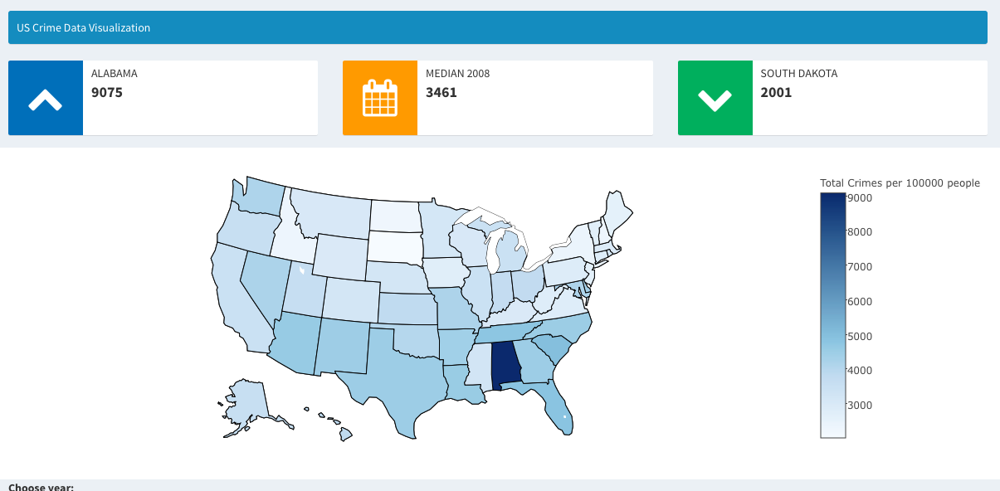
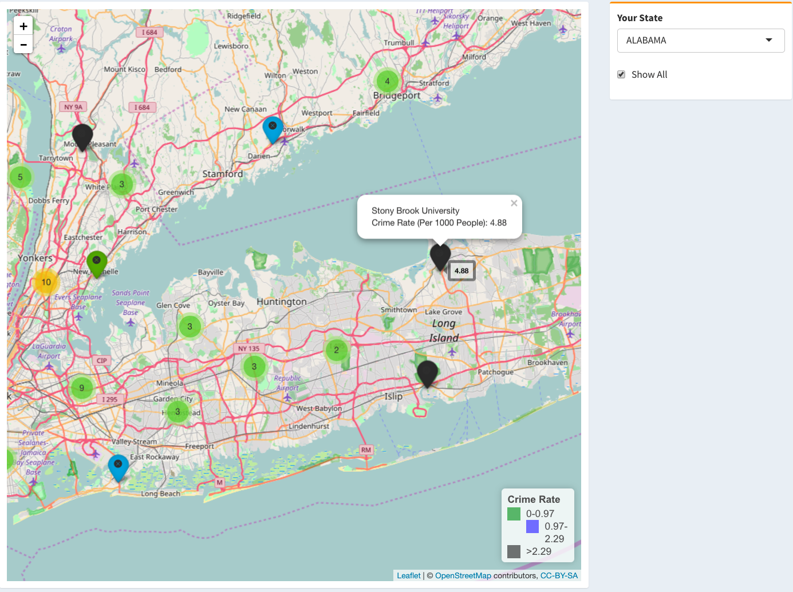
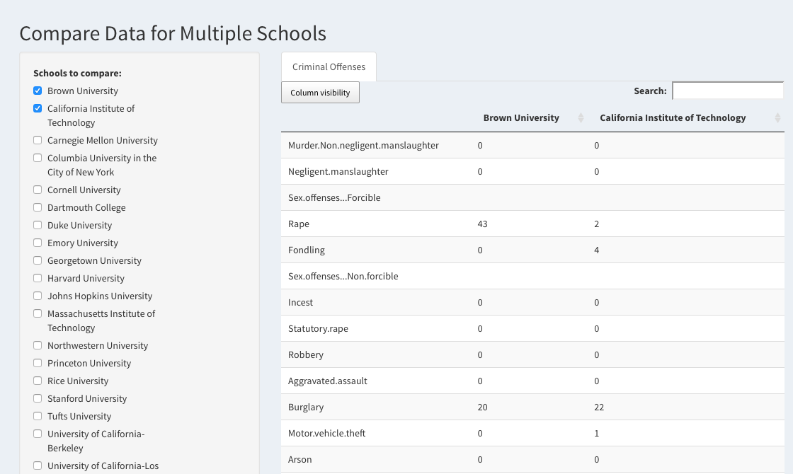

# Project 2: Open Data App - an RShiny app development project

### [Project Description](doc/project2_desc.md)






In this second project of GU4243/GR5243 Applied Data Science, we develop an *Exploratory Data Analysis and Visualization* shiny app on a topic of your choice using U.S. government open data released on the [data.gov](https://data.gov/) website. See [Project 2 Description](project2_desc.md) for more details.  

The **learning goals** for this project is:

- business intelligence for data science
- data cleaning
- data visualization
- systems development/design life cycle
- shiny app/shiny server

*The above general statement about project 2 can be removed once you are finished with your project. It is optional.

## Project Title Lorem ipsum dolor sit amet
Term: Spring 2017

+ Team #15
+ **Projec title**: US Campus Crime
	+ Chenyun Zhu
	+ Nanjun Wang
	+ Yuxin Zhu
	
+ **App link**: https://campus-crime-wzz.shinyapps.io/update_new_final/

+ **Project summary**: We design a Shinyapp to help perspective students who take safety as priority when selecting universities in United States. To use this app, it only takes three steps. First, select optimal states. Second, select multiple schools. Third, compare them and make final decision. To accomplish these three steps, we design three functioning parts: US state crime map, US school cirme map, comparasion data table. If users follow our steps by using three parts in order, they will find their optimal school to choose.

+ **Contribution statement**: ([default](doc/a_note_on_contributions.md)) All team members contributed equally in all stages of this project. Yuxin Zhu is mainly responsible for the first tab "US Crime Map", Chenyun Zhu is mainly responsible for the second tab "US Campus Crime", Nanjun Wang is mainly responsible for the third tab " Comparasion". All team members approve our work presented in this GitHub repository including this contributions statement. 

Following [suggestions](http://nicercode.github.io/blog/2013-04-05-projects/) by [RICH FITZJOHN](http://nicercode.github.io/about/#Team) (@richfitz). This folder is orgarnized as follows.

```
proj/
├── app/
├── lib/
├── data/
├── doc/
└── output/
```

Please see each subfolder for a README file.

